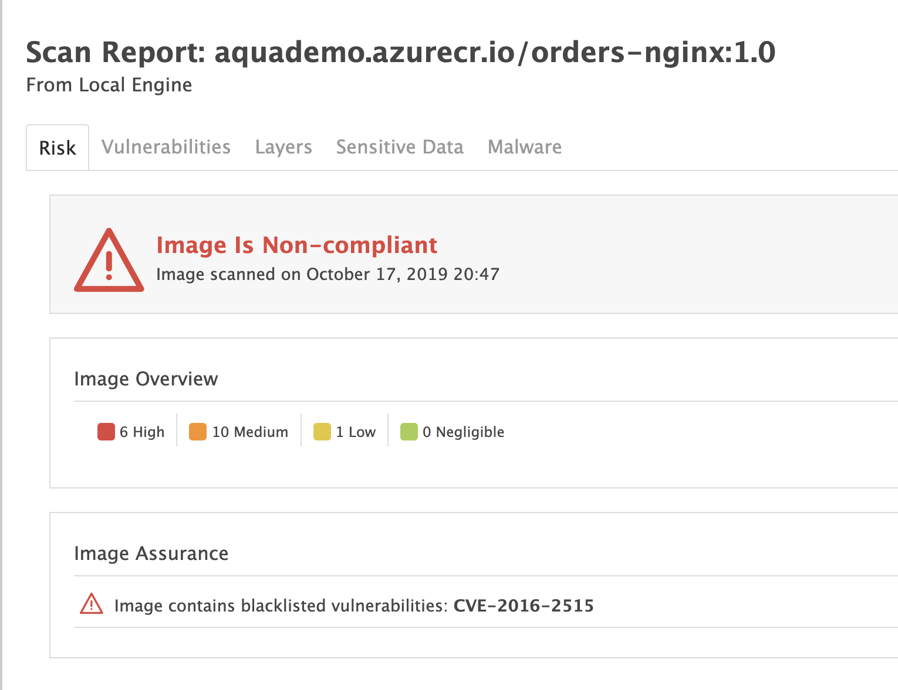
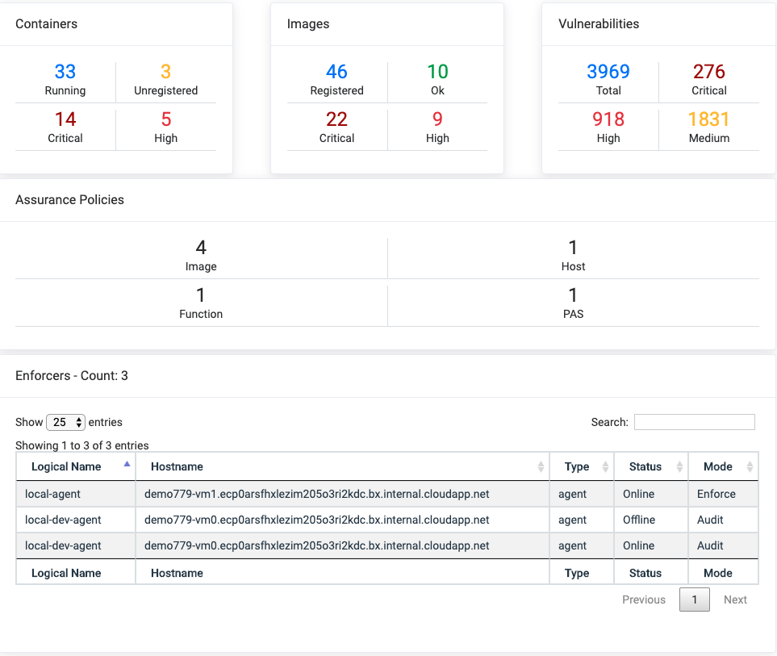

# Aqua-Reports

[](https://travis-ci.org/BryanKMorrow/aqua-reports)
[](https://goreportcard.com/report/github.com/BryanKMorrow/aqua-reports)
[](https://github.com/BryanKMorrow/aqua-reports/blob/master/LICENSE)





# Table of Contents

- [Abstract](#abstract)
- [Features](#features)
- [Installation](#installation)
  - [From Source](#from-source)
- [Quick Start](#quick-start)
  - [Basic](#basic)
  - [Docker](#docker)
- [Examples](#examples)
  - [Executive Overview](#executive-overview)
  - [All Images](#all-images)
  - [One Image](#one-image)
  - [List of Images](#list-images)

# Abstract

`Aqua Reports` is a basic API server that provides reports for the Aqua Security Cloud Native Security Platform (CSP). `Aqua Reports` does this by pulling information directly from the Aqua CSP API.  

# Features

- Executive Overview
  - Containers (Running, Unregistered, With Criticals, With Highs, With No Vulnerabilities)
  - Images (Total, With Criticals, With Highs, With Mediums, With Lows, With No Vulnerabilities)
  - Vulnerabilites (Total, Criticals, Highs, Mediums, Lows)
  - Enforcers (Count)
    - Each Enforcer (Name, Hostname, Status, Mode)
- Image Report
  - Risk (Assurance and Compliance)
  - Vulnerabilities (CVEs)
    - By Resource
    - By Layer
  - Malware Detection
  - Sensitive Data Detection

# Installation

## From Source

```sh
mkdir -p $GOPATH/src/github.com/BryanKMorrow
cd $GOPATH/src/github.com/BryanKMorrow
git clone https://github.com/BryanKMorrow/aqua-reports
cd aqua-reports/cmd/aqua-reports
export GO111MODULE=on
go install
```

# Quick Start

## Basic

Start the web server.

```sh
aqua-reports --mode cli --url http://<url to aqua console> --user <api user> --password <api user password> --port <port for webserver>
```

## Docker

Pull and run the image.

Set the required environment variables.

```sh
export AQUA_URL=http://<url to aqua console>   (note: just the base url)
export AQUA_USER=<api user>
export AQUA_PASSWORD=<api user password>
export AQUA_REPORTS_PORT=<port for webserver>
```

```sh
docker pull bkmorrow/aqua-reports:latest
docker run --rm --name aqua-reports -v /tmp/reports:/go/src/github.com/BryanKMorrow/aqua-reports/reports -p 8000:8000 --env AQUA_URL=https://aquasec.example.com --env AQUA_USER=api --env AQUA_PASSWORD=password --env AQUA_REPORTS_PORT=8000 bkmorrow/aqua-reports:latest 
```

# Examples

To view the images you access the following directory on the container for a list of reports:
`http://aqua-reports-container:8000/reports`

## Executive Overview

```sh
curl https://aqua-reports-container:8000/api/v1/reports/overview
```

## All Images

```sh
curl https://aqua-reports-container:8000/api/v1/reports/all
```

## Stream All Images
If your browser (Chrome) supports streaming, you can stream the report creation and follow the progress.
```sh
curl https://aqua-reports-container:8000/api/v1/reports/streams/all
```

## One Image
This will have three parameters, {registry}/{image}/{tag}. The registry references the logical name assigned to the registry in Aqua.
```sh
curl https://aqua-reports-container:8000/api/v1/reports/Docker%20Hub/centos/7
```

## List of Images

```sh
curl -d '[{"image": "postgres","tag": "9.5","registry": "Docker Hub"},{"image": "alpine","tag": "3.7","registry": "Docker Hub"}]' -H "Content-Type: application/json" -X POST https://aqua-reports-container/api/v1/reports/images
```

# License

This repository is available under the [GNU Affero General Public License v3.0](https://github.com/BryanKMorrow/aqua-reports/blob/master/LICENSE)

# Author

[Bryan Morrow](https://github.com/BryanKMorrow) (BryanKMorrow)  
